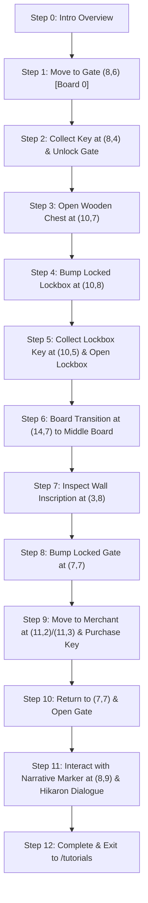

# DreamTower — Tutorial Documentation

This document provides a comprehensive guide and technical specification for all interactive tutorial flows in **DreamTower**. The tutorials page (`/tutorials`) acts as the entry point for players to learn core gameplay mechanics.

---

## 1. Overview of Tutorials

The Tutorials Hub contains four primary training modules:

| Tutorial Module | Status | Description |
| :--- | :--- | :--- |
| **Dungeon** | **Coded & Active** | Teaches board navigation, locked gates, key collection, chest opening, board transitions, wall inscriptions, merchant interaction, and narrative markers. |
| **Combat** | *Planned* | Teaches turn-based battle mechanics, skill queuing, stamina & resolve management, and monster target selection. |
| **Card Duel** | *Planned* | Teaches card deck assembly, spirit management, card placement, reserve units, and duel strategy. |
| **TBD / Advanced** | *Locked* | Reserved for advanced mechanics including Automaton automation, Scrying, Rituals, and Siege warfare. |

---

## 2. Dungeon Tutorial (Complete Step-by-Step Sequence)

The **Dungeon Tutorial** automatically guides the player through a curated 4D dungeon map (`tutorial-export.json`) demonstrating core exploration loops.

### Detailed Sequence Breakdown

#### Step 0: Introduction
- **Action**: Dungeon loads with starting spawn point at Board 0.
- **Narrative Overlay**: `"In DreamTower your crew moves around a 4d dungeon."`

#### Step 1: Locked Gate Encounter (Board 0)
- **Movement**: Player moves from spawn `(5,6)` $\rightarrow$ `(6,6)` $\rightarrow$ `(7,6)` $\rightarrow$ bumps into locked gate at `(8,6)`.
- **Narrative Overlay**: `"You will encounter locked gates that need keys to progress."`

#### Step 2: Key Collection & Unlocking Gate
- **Movement**: Navigates left `(6,6)` $\rightarrow$ up `(6,5)` $\rightarrow$ up `(6,4)` $\rightarrow$ right `(7,4)` $\rightarrow$ `(8,4)` to pick up **Minor Key**.
- **Return Movement**: Navigates back to `(8,6)` to consume key and open the archway gate.
- **Narrative Overlay**: `"collect keys to ensure free will"`

#### Step 3: Chest Interaction
- **Movement**: Walks through archway to `(10,6)` $\rightarrow$ `(11,6)` $\rightarrow$ down `(11,7)` $\rightarrow$ left `(10,7)` to open **Wooden Chest**.
- **Narrative Overlay**: `"Some items are laying on the ground, some are in chests"`

#### Step 4: Locked Lockbox Encounter
- **Movement**: Moves right `(11,7)` $\rightarrow$ down `(11,8)` $\rightarrow$ left into `(10,8)` to attempt opening locked **Lockbox**.
- **Narrative Overlay**: `"Some chests are locked"`

#### Step 5: Lockbox Key & Opening Lockbox
- **Movement**: Navigates to `(10,5)` via `(12,8)`/`(12,5)` to collect **Lockbox Key**, returns to `(10,8)` to unlock chest.
- **Narrative Overlay**: `"Lockbox keys will open locked chests"`

#### Step 6: Board Transition
- **Movement**: Pathfinds to connecting path tile `(14,7)` and steps right across board edge into **Middle Board (Board 1)**.
- **Narrative Overlay**: `"Moving through connecting paths transitions your crew to adjacent boards."`

#### Step 7: Wall Inscription Interaction
- **Movement**: Walks right to `(3,7)` $\rightarrow$ down to `(3,8)` to inspect **Wall Inscription**.
- **Narrative Overlay**: `"Interact with wall inscriptions by double-moving into them, or clicking/tapping on them..."`

#### Step 8: Gate Encounter (Middle Board)
- **Movement**: Navigates up `(3,6)` $\rightarrow$ right along line `y=6` to `(7,6)` $\rightarrow$ down to bump locked Gate at `(7,7)`.
- **Narrative Overlay**: `"This gate is locked! Explore surrounding corridors for keys to open passage."`

#### Step 9: Merchant Interface & Key Purchase
- **Movement**: From `(7,6)`, navigates right to `(11,6)` $\rightarrow$ up `(11,5)` $\rightarrow$ `(11,4)` $\rightarrow$ `(11,3)`.
- **Merchant Interaction**: Interacts with Merchant structure at tile `(11,2)` from `(11,3)`.
- **Interface**: Opens Merchant modal showing stock items.
- **Highlight**: Key item tile flashes with animated gold highlight (`.tutorial-key-flash`).
- **Narrative Text**: `"keys can be found in the dungeon or purchased from the merchant"`
- **Purchase**: After pause, player acquires the Minor Key (added to inventory) and closes the Merchant interface.

#### Step 10: Unlocking Gate at (7,7)
- **Movement**: Navigates back down `(11,3)` $\rightarrow$ `(11,6)` $\rightarrow$ left `(7,6)` $\rightarrow$ down `(7,7)`.
- **Result**: Minor Key is consumed and Gate at `(7,7)` opens!

#### Step 11: Narrative Marker & Hikaron Sequence
- **Movement**: Passes through open gate at `(7,7)` $\rightarrow$ down `(7,8)` $\rightarrow$ right `(8,8)` $\rightarrow$ down `(8,9)`.
- **Narrative Marker Interaction**: Interacts with Brazier / Narrative Marker at `(8,9)`.
- **Narrative Text**: `"narrative markers will progress the linear story"`
- **Hikaron Dialog Modal**: Opens custom `NarrativeOverlay` pane featuring Hikaron portrait flickering into view and typewriter text:
  > **Hikaron**: `"hello....."`
- **Pause & Close**: After typewriter text reveals and lingers, the modal auto-closes.

#### Step 12: Tutorial Completion & Exit
- **Banner**: `"🎯 Tutorial Complete!"`
- **Navigation**: Redirects player back to `/tutorials`.

---

## 3. Combat Tutorial (Specification)

*Planned Module* — Designed to introduce players to turn-based squad battles.

### Key Learning Objectives
1. **Turn Sequence & Initiative**: How party speed determines action order.
2. **Skill Queuing**: Selecting abilities, targeting enemies/allies, and confirming actions.
3. **Stamina & Resolve**: Managing energy costs and handling morale/resolve drops.
4. **Perks & Passives**: Triggering class perks during combat.

---

## 4. Card Duel Tutorial (Specification)

*Planned Module* — Designed to teach card duels and deckbuilding.

### Key Learning Objectives
1. **Deck Assembly & Draw**: Mana costs, reserve cards, and drawing hands.
2. **Card Placement & Lanes**: Deploying units into tactical grid lanes.
3. **Spirit & Mana Limits**: Max spirit rules (capped at 10) and card energy management.
4. **Victory Conditions**: Reducing opponent leader health to zero.

---

## 5. TBD / Future Modules

Reserved for upcoming game expansions:
- **Automatons & Automation**: Setting up mechanical harvesters and generators.
- **Scrying & Lore**: Uncovering secret map loci and answering lore riddles.
- **Tower Siege**: Multi-floor assault mechanics against boss commanders.

---

## 6. Established Combat Grid Sizes & Specifications

DreamTower uses standardized combat grid tiers designed for different encounter scales:

| Grid Tier | Dimensions (Rows × Cols) | Total Tiles | Accessible Routes | Description |
| :--- | :--- | :--- | :--- | :--- |
| **`small`** | 6 Rows × 8 Columns | 48 Tiles | Dungeons, Random Encounters, Combat Simulator (Default) | Standard battle layout for squad encounters. |
| **`large`** | 8 Rows × 12 Columns | 96 Tiles | **Combat Simulator Only** (Toggleable) | Expanded tactical grid offering 96 tiles for large squad/minion testing. |
| **`siege`** | 14 Rows × 20 Columns | 280 Tiles | Siege Mode (`TowerSiege`) | Massive battlefield grid for army-vs-army siege engagements. |

### Responsive Tile Sizing Rules
All combat views dynamically calculate `TILE_SIZE` based on the viewport height and board row count so the full board remains visible on-screen without vertical scrolling:
$$\text{TileSize} = \text{clamp}\left(\left\lfloor \frac{\text{ViewportHeight} - \text{ReservedUIHeight}}{\text{Rows}} \right\rfloor, \text{MinTileSize}, \text{MaxTileSize}\right)$$
- **Small (6x8)**: Rows = 6, TileSize range: 50px – 100px.
- **Large (8x12)**: Rows = 8, TileSize range: 36px – 85px.
- **Siege (14x20)**: Rows = 14, TileSize range: 30px – 56px.

