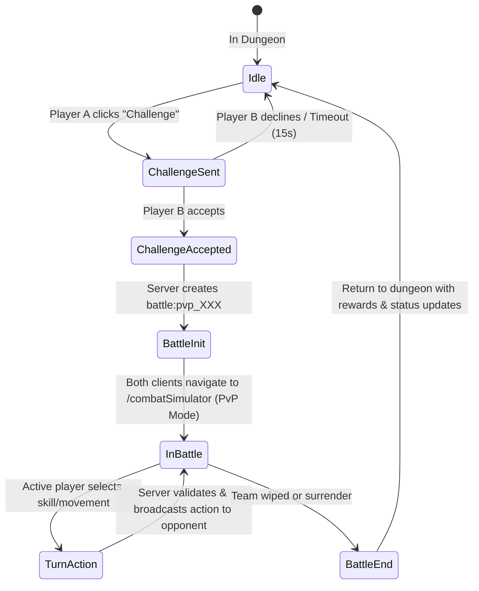

# Real-Time WebSockets & PvP Combat Implementation Plan

## Executive Summary
This document outlines the end-to-end technical architecture, network protocol, backend event handlers, client integration, data schemas, and phase-by-phase rollout for adding real-time multiplayer WebSockets to **ReStack**.

- **Phase 1: Real-Time Dungeon Presence & Co-Presence** — Enables players in the same dungeon instance to see each other's position, movement, level/orientation, and crew summary in real time on the dungeon map grid.
- **Phase 2: Real-Time PvP Combat & Match Synchronization** — Enables players occupying adjacent/same tiles to initiate a PvP battle challenge, transition both clients into the Combat Simulator (`MonsterBattle`), and synchronize crew turns, skills, health updates, and victory/defeat rewards over WebSockets.

---

## 1. System Architecture & Tech Stack

### 1.1 Technology Selection
- **Backend (`restack_backend`)**: `socket.io` (v4.x) attached to Node.js/Express HTTP server.
- **Frontend (`restack_client`)**: `socket.io-client` (v4.x) integrated with React state management.
- **Transport Protocol**: WebSockets with automatic HTTP long-polling fallback.
- **Authentication**: JWT token verification via socket handshake (`socket.handshake.auth.token`).
- **State Management & Persistence**:
  - **Socket Rooms**: Named room channels per dungeon instance (`dungeon:{dungeonId}`) and per battle match (`battle:{battleId}`).
  - **In-Memory Presence Store**: Real-time tracking of active players per dungeon, current level (`levelId`), orientation (`front`/`back`), coordinates (`tileIndex` / `[x, y]`), and active battle states.

### 1.2 Room & Topology Diagram
```
                     ┌──────────────────────────────┐
                     │    Socket.io Server Hub      │
                     └──────────────┬───────────────┘
                                    │
           ┌────────────────────────┴────────────────────────┐
           ▼                                                 ▼
┌──────────────────────────┐                      ┌──────────────────────────┐
│  Room: dungeon:carcosa   │                      │   Room: battle:pvp_8842  │
│  (Presence & Movement)   │                      │   (Synchronized Combat)  │
└──────────┬───────────────┘                      └──────────┬───────────────┘
           │                                                 │
     ┌─────┴─────┐                                     ┌─────┴─────┐
     ▼           ▼                                     ▼           ▼
 Player A     Player B                            Player A     Player B
```

---

## 2. Phase 1: Real-Time Dungeon Presence & Movement

### 2.1 Socket Event Protocol (Presence)

| Event Name | Direction | Payload Schema | Description |
|---|---|---|---|
| `dungeon:join` | Client ➔ Server | `{ dungeonId, userId, username, location: { levelId, orientation, tileIndex, x, y }, crewSummary: [...] }` | Sent when entering Dungeon view or loading instance. Server joins socket to `dungeon:{dungeonId}` room. |
| `dungeon:leave` | Client ➔ Server | `{ dungeonId, userId }` | Sent when exiting Dungeon view or logging off. |
| `dungeon:presence_snapshot` | Server ➔ Client | `{ players: [ { userId, username, location, crewSummary, socketId } ] }` | Initial snapshot sent to newly joined player listing all active peers in the dungeon instance. |
| `dungeon:player_joined` | Server ➔ Client (Broadcast) | `{ userId, username, location, crewSummary, socketId }` | Broadcast to room when a new peer joins the dungeon. |
| `dungeon:player_left` | Server ➔ Client (Broadcast) | `{ userId }` | Broadcast when a peer leaves or disconnects. |
| `dungeon:move` | Client ➔ Server | `{ dungeonId, userId, location: { levelId, orientation, tileIndex, x, y } }` | Fired when player moves to a new tile, changes level, or flips plane. |
| `dungeon:player_moved` | Server ➔ Client (Broadcast) | `{ userId, location }` | Broadcast to all clients in `dungeon:{dungeonId}` so peer tokens update position in real time. |

### 2.2 Client Rendering Integration (`DungeonPage.js` & `DungeonView.js`)
1. **Socket Manager Utility** (`src/utils/socket-handler.js`):
   - Initializes singleton socket client connection.
   - Manages auto-reconnects, heartbeat, and JWT token injection.
2. **Peer Players Layer in `DungeonView.js`**:
   - Render peer player tokens on the map grid matching their `location` (filtered by active `levelId` and `orientation`).
   - Peer tokens feature player avatar badge, username tag, and animated pulse indicator.
   - Smooth CSS linear transition when peer `location` updates.
3. **Interactive Context Menu on Peer Token**:
   - Right-click or tap on peer player avatar opens interaction menu:
     - `Inspect Crew`
     - `Challenge to PvP Battle`

---

## 3. Phase 2: Real-Time PvP Crew Combat

### 3.1 PvP Challenge Flow & State Machine



### 3.2 Socket Event Protocol (PvP Combat)

| Event Name | Direction | Payload Schema | Description |
|---|---|---|---|
| `pvp:challenge_send` | Client ➔ Server | `{ targetUserId, dungeonId }` | Challenger initiates challenge to peer. |
| `pvp:challenge_received` | Server ➔ Client (Target) | `{ challengerId, challengerName, challengerCrewSummary }` | Target receives modal prompt to Accept or Decline (15s timer). |
| `pvp:challenge_response` | Client ➔ Server | `{ challengerId, accepted: boolean }` | Target responds. |
| `pvp:battle_start` | Server ➔ Both Clients | `{ battleId, playerA: { userId, crew }, playerB: { userId, crew }, turnOrder: [...], seed }` | Server instantiates combat session and forces both clients into `MonsterBattle` PvP view. |
| `pvp:turn_action` | Client ➔ Server | `{ battleId, actorFighterId, actionType: 'skill'/'move'/'endTurn', targetFighterId, skillKey, position }` | Player executes action during their turn. |
| `pvp:action_broadcast` | Server ➔ Opponent | `{ actorFighterId, actionType, targetFighterId, skillKey, position, outcome: { damage, hits, statusEffects } }` | Server validates action and syncs to opponent client so animations replay identically. |
| `pvp:battle_end` | Server ➔ Both Clients | `{ battleId, winnerId, loserId, rewards: { exp, gold, shimmer } }` | Triggered on team wipe; updates database and exits combat view back to dungeon. |

### 3.3 PvP Combat Synchronization Architecture (`MonsterBattle.js`)
1. **Turn Locking & Input Guard**:
   - In PvP mode, input controls (skills, target selection, movement) are locked during the opponent's turn.
   - Turn timer (30 seconds) enforced by server; auto-ends turn if timer expires.
2. **Deterministic Outcome & Server Validation**:
   - Skill execution RNG seeds are shared upon `pvp:battle_start` or evaluated server-side to prevent client desync.
3. **Graceful Disconnect Handling**:
   - 30-second reconnection window if a client drops mid-battle.
   - If player fails to reconnect within window, forfeit victory is awarded to remaining player.

---

## 4. Backend Implementation Plan (`restack_backend`)

### 4.1 Dependency Additions
- Install `socket.io` (v4.x) in `restack_backend`:
  ```bash
  npm install socket.io
  ```

### 4.2 File Structure Modifications (Backend)
```
restack_backend/
├── index.js                     # Attach Socket.io to HTTP server
├── sockets/
│   ├── socketManager.js          # Connection & JWT authentication middleware
│   ├── dungeonPresenceHandler.js# Event handlers for dungeon join/leave/move
│   └── pvpCombatHandler.js      # Event handlers for PvP challenge & battle state machine
└── services/
    └── presenceService.js       # In-memory player position tracking
```

---

## 5. Frontend Implementation Plan (`restack_client`)

### 5.1 Dependency Additions
- Install `socket.io-client` in `restack_client`:
  ```bash
  npm install socket.io-client
  ```

### 5.2 File Structure Modifications (Frontend)
```
restack_client/src/
├── utils/
│   └── socket-handler.js        # Singleton socket client connection & event emitter
├── pages/
│   ├── DungeonPage.js           # Subscribes to dungeon presence; renders peer tokens
│   └── sub-views/
│       └── MonsterBattle.js     # Extended to support PvP multiplayer mode
└── components/
    └── PvPChallengeModal.js     # Modal for incoming & outgoing battle challenges
```

---

## 6. Phase-by-Phase Verification & Testing Strategy

### Step 1: Backend Socket Core Setup
- Verify socket connection, authentication handshake, and room join/leave in `restack_backend`.
- Test with simultaneous browser windows (Player A and Player B).

### Step 2: Dungeon Co-Presence Verification
- Log in as User 1 on Window 1 and User 2 on Window 2.
- Move User 1 in `carcosa` Level 0 Front.
- Confirm User 2 sees User 1's avatar token moving on the map grid in real time.

### Step 3: PvP Battle Challenge & Handshake
- User 1 clicks User 2's token and selects "Challenge to PvP".
- User 2 receives modal challenge prompt; accepts.
- Confirm both clients transition to `MonsterBattle` PvP arena view.

### Step 4: PvP Turn Sync & Battle Result
- User 1 executes a skill; confirm animation and health reduction render on User 2's screen.
- Verify match completion, victory banner, and return to Dungeon view.
